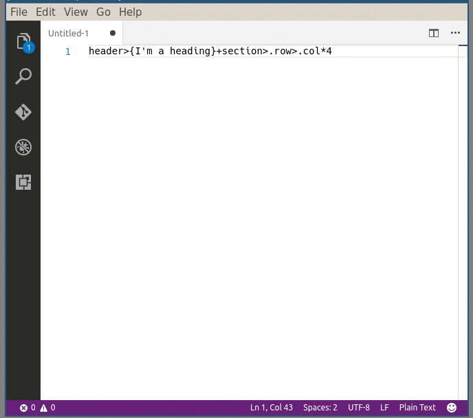

# Mithril Emmet support for VS Code

Add [Emmet][emmet] (zen-coding) support for [Mithril][mithril] inside vscode, can also be used to create [hyperscript][hyperscript].

## Screenshot


## Usage

Use VS Code Command: `Expand Emmet to Mithril`

Optionally, You can bind `mithrilEmmet.expand` to a shortcut via `File -> Preferences -> Keyboard Shortcuts`.

Example:

```json
[{
  "key": "cmd+alt+e",
  "command": "mithrilEmmet.expand",
  "when": "editorFocus"
},
{
  "key": "ctrl+alt+e",
  "command": "mithrilEmmet.expand",
  "when": "editorFocus"
}]
```

## Configuration

```json
{
  "mithrilEmmet.vnodeFactoryFunctionName": "m",  //  Specifies the name of vnode factory function. E.g. for mithril, use 'm'; for hyperscript, use 'h'.
  "mithrilEmmet.outputDefaultTagName": true  //  If false, default tag name ('div')  will be obmitted, i.e. '.some-class' instead of 'div.some-class'
}


```


## Known Issues

- Does not support tab stops (see: https://github.com/Microsoft/vscode/issues/3210)
- Some emmet snippets are not supported (e.g. `!!!` => `<!DOCTYPE html>`)

## Release Notes

### 0.6.0

Support insert snippet

### 0.5.0

Now support custom function name (to support hyperscript, cyclejs, etc.)

### 0.4.0

Support expanding while cursor is inside a abbreviation

### 0.3.0

Remove tab stop placeholders from output

### 0.0.1

First release


[emmet]: http://emmet.io/
[mithril]: http://mithril.js.org/
[hyperscript]: https://github.com/dominictarr/hyperscript